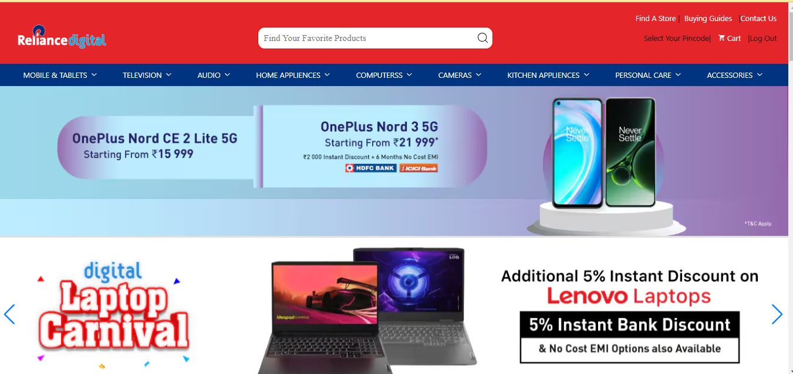
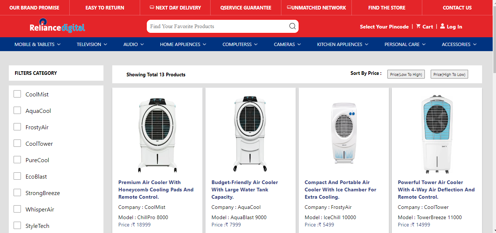
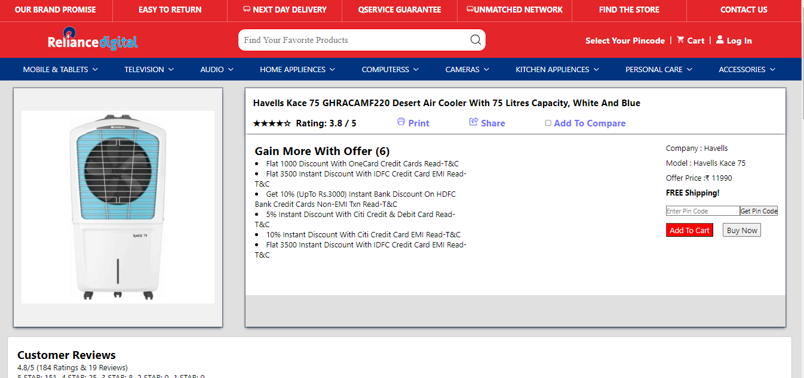
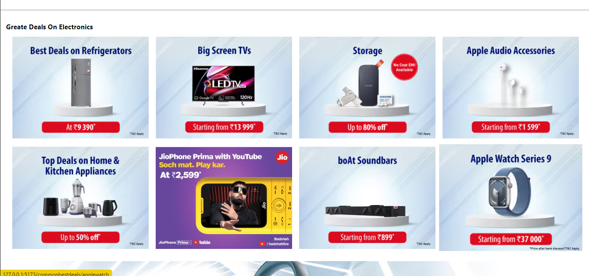
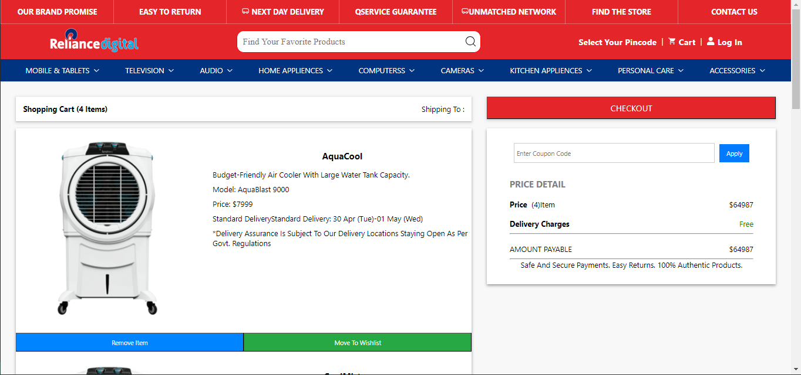

# Reliance Digital Ecommerce

this is a clone of Reliance Digital Ecommerce   ,  is operated by Reliance Retail, Ltd. and offers a wide range of consumer electronics, home appliances, computing and mobility products, latest gadgets, and accessories. 

## Live Demo

Explore the live demo: [Flipkart Clone](https://65aeb52a4dab7b3a0094a54a--superlative-blini-198462.netlify.app/)


## Color Reference

| Color             | Hex                                                                |
| ----------------- | ------------------------------------------------------------------ |
| White             |  #ffffff |
| Black             |  #000000 |
| Blue              |  #0000ff |
| Red               |  #ff0000 |


## Documentation

[click Documentation](https://trello.com/invite/b/Q8gv85mL/ATTIaee27ddb3c9ac4fead572c71347e0e25B3437433/reliance-digital-ecart-clone)


## Features

1. **User Authentication**
   - Users can register and log in to the application.
   - Secure user authentication mechanism using tokens.
   - Persistent login state using local storage.

2. **Page Authentication**
   - Full authentication on sensitive pages (e.g., product details, cart).
   - Users without proper authentication cannot access certain pages.

  3. **Shopping Cart**
   - Users can add products to their shopping cart.
   - Cart contents persist across sessions using local storage.
   - Ability to remove products from the cart.

 4. **Responsive Design**
   - Ensures a consistent and pleasant user experience across various devices.   

5. **funationality**
- Fullscreen mode
- Cross platform
- full responsive
- filter 
- hover good style 
- icon style effect
- access city location
- authentication
- redux for reduce work
- thunk for async operation
- local storage for data
- vite app

## Acknowledgements
We extend our thanks to the following:

- **React**: This project is built using the React library, an open-source JavaScript library maintained by Facebook. The React community's dedication to providing a powerful and efficient front-end development experience is invaluable.

- **Font Awesome-icons**: We leverage the icon font toolkit provided by Font Awesome. Their `@fortawesome/fontawesome-free` package enhances our project's visual appeal with a wide variety of scalable icons.

- **React Router-dom**: A big thank you to the maintainers and contributors of `react-router-dom` for making navigation in React applications smooth and intuitive.

- **Axios**: We appreciate the simplicity and effectiveness of Axios, a promise-based HTTP client. Axios has streamlined our data fetching and API communication, contributing to the project's overall success.

- **react-redux**: React Redux is a library that provides centralized state management for React applications. It helps in managing complex state logic by maintaining a global store accessible to any component. Redux follows a predictable pattern for state updates, ensuring consistency and ease of debugging. Additionally, it promotes separation of concerns by keeping state management separate from presentation logic, enhancing code maintainability and testability.

- **react-toastify**:is a React library that simplifies the creation of toast notifications. It allows developers to easily display brief messages to users, providing feedback or updates in a non-intrusive manner.

- **redux-thunk**:  is a Redux middleware enabling asynchronous operations in action creators by allowing them to return functions instead of plain objects. This facilitates managing side effects like asynchronous API requests and coordinating multiple actions within Redux applications.

- **Swiper**:Swiper is a popular JavaScript library for creating touch-enabled, responsive carousels and sliders in web applications. It provides a robust and customizable solution for creating interactive and mobile-friendly slideshows with smooth transitions and swipe gestures.

These dependencies have significantly contributed to the success and functionality of our project. We extend our gratitude to the developers and communities behind these technologies.

## API Reference
`https://nominatim.openstreetmap.org/search?postalcode=${text}&countrycodes=IN&format=json&addressdetails=1&limit=1`
this is api for getting location by city code

### Get All Products

responsive format 

{ "AllData" :[
    {
    "id": 1,
    "category":"mobile",
    "company": "Vivo",
    "model": "Vivo V21",
    "price": 21999,
    "description": "Vivo T3 5G 256 GB, 8 GB RAM, Cosmic Blue, Mobile Phone",
    "pic": "https://www.reliancedigital.in/medias/Vivo-T3-5G-Blue-Mobile-Phone-494353021-i-1-1200Wx1200H-300Wx300H?context=bWFzdGVyfGltYWdlc3w4Mjk5OXxpbWFnZS9qcGVnfGltYWdlcy9oNzEvaDllLzEwMTI2ODQwODU2NjA2LmpwZ3w3MmE4NDVjNjJmNjU0NDZkNWU3Y2YxMDI4MTMwNzQ5ODliNzM0MzU0MDZkN2NhZTFhYTg3YTgxMDg3OTY1NTdm"
  },
]
}

## Screenshots


this is home page


this is products when click any category 


this is single product 


this is category at home page


this is cart 


## Reliance Digital Ecommerce Documentation Project Structure

The project structure is organized to provide a clear and modular layout. Below is an overview of the main folders and their contents:

- **Reliance Digital Ecommerce-app:** The main folder for the Reliance Digital Ecommerce.

 ### 1. `node models`
  - This folder contains models related to the Node.js backend.
    ### 2. `public`
  - The public folder typically contains static assets that are publicly accessible.

   ### 3. `src`
  - The `src` folder is the core of the application, containing various components, assets, and the main application files.

     #### Subfolders Inside `src`

      #### 3.1 `assets`
    - This folder stores static assets used in the application.

    #### 3.2 `components`
    - Beast Deals component
    -buy product
    - delevery location (getting location from api)
    -Eay return 
    -HoNor x3 lite airbuds
    -list of products (all product list )
    -loding  error (for error )
    -logo (logo of website)
    -NavBar list items(for mobile version)
    -pincodeNavBar(for passing the data to delevery location component )
    -search (for earching the product)
    -service guarantee
    -subitems (list of subitems)
    -sublist (list of all category sub items)
    -the reliance digital brand promise
    -rest are acarocials
    #### 3.3 `context`
    -this folder use for authentication of user
    #### 3.4 `db`
    - this folder is use for create manually json data
    #### 3.5 `images`
    - here are some images how website look like
    #### 3.6 `pages`
    - AllData page (for render all data)
    - Apployout (this is home page)
    - buying guides
    - cart
    - commoncomponent for rendering data(here data render category wise)
    - contact us
    - fins store
    - login
    - single pages (here data will render snigle )

    #### 3.7 `redux`
    - action (all the actions perform here)
    - reducer ( fro storing data)
    - store ( this is for accesing in all application and add thunk)
     #### 3.8 `routes`
     - all routes 
     - private routes
     #### 3.9 `section`
     - navbar
     - allnavbar
     - footer

 This structured approach ensures a clean organization of files and components within the Everest Spices App. Adjustments can be made as the project evolves or based on specific requirements.


## Feedback

If you have any feedback, please reach out to us at sharma.harshit295@gmail.com.com


## 🚀 About Me
Hello , my name is Harshit Kumar Sharma
im a front end doveloper , and trainee at masai school plateform,

### Motivation

I embarked on this project with the goal of [to get good job and coding also my  hoby , when i write code then i feel relief ]. Whether it's solving a specific problem, exploring new technologies, or simply exercising creativity, I am excited to share this project with the community.

### Technical Stack
- **Frontend:** HTML, CSS, JavaScript,react,github ,redux


## 🔗 Connect with Me


- GitHub: [HarshitSharma2250](https://github.com/HarshitSharma2250)
- LinkedIn: [Harshit Sharma](https://www.linkedin.com/in/harshit-sharma-552038236/)
- Portfolio: [Harshit Sharma](https://harshitsharma2250.github.io/)
- Twitter: [@HarshitSharma](https://twitter.com/sharmaharshit26)


## Installation

Install my-project with npm
```bash
  npm install my-project
  cd my-project
  npm run dev
```

